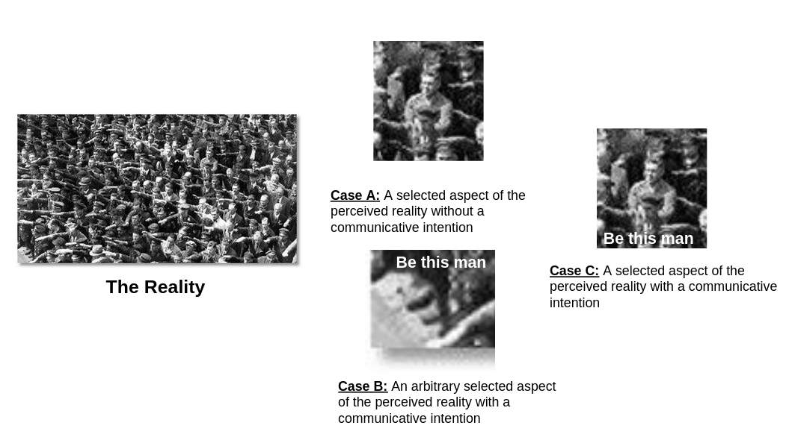

```{r setup, include = FALSE}
library(papaja)
library(tidyverse)
library(brms)
```

```{r analysis-preferences}
# Seed for random number generation
set.seed(42)
knitr::opts_chunk$set(cache.extra = knitr::rand_seed)
```

# Introduction

The goal of this study is to provide a benchmark dataset for evaluating frames found through any method (e.g. Latent Dirichlet Allocation or Structural Topic Models). In order to achieve this goal, we first review the concept of frames in communication research and then highlight the conceptual and methodological issues of the notion of automatic detection of frames. And then we outline our approach to produce such a dataset, analyze the dataset, and report the preliminary results.

## Entmanian frame and the tacit aspect of communicative intention

The notion of (media) frame is probably one of the central concepts in communication research. As of writing, a simple keyword search of "Frame" returned 1278 results from *Journal of Communication* alone. In several journals of the field, special issues have been published to solely interrogate this central concept (e.g. *Journal of Communication* 57:1; *Media, War & Conflict* 11:4).

Even before the onset of the so-called "Computational Turn" of journalism research [@hase:2022:CT] and the notion of automated content analysis [@boumans:2015:tst], detection of frames has been a greatly discussed topic even in the context of traditional manual content analysis. Experts in the field have discussed the issue as fundamental as the definition of the concept. The contested [@dangelo:2002:NFM], but highly cited, definition by @entman:1993:F states that framing (an act, i.e. a verb) is "select[ing] some aspects of a perceived reality and mak[ing] them more salient in a communicating text, in such a way as to promote a particular problem definition, causal interpretation, moral evaluation, and/or treatment recommendation for the item described." We restate the Entmanian definition of *framing* (verb) to describe the noun *frame*: Frame is the result of an act of selecting certain aspects of a perceived reality by a communicator, whose intention is to promote a particular problem definition, causal interpretation, moral evaluation, and/or treatment recommendation. Our restatement makes explicit the tacit aspect of **communicative intention** in the original definition. Our restatement is also compatible with @scheufele:2006:FAS's "three models of political communication", which differentiate between framing, agenda setting, and priming. In their models, framing refers to "modes of presentation that journalists and other communicators use to present information in a way that resonates with existing underlying schemas among their audience." The underlying communicative intention is then to "resonate with existing underlying schemes among their audience." Similarly, @baden2015infocore's definition of Interpretative Frame also focuses on strategic and constructive purposes. In psychology, the research on framing also deals with the communicative intention of influencing choices and decisions through different ways to represent the same information [e.g. @tversky:1981:FDP].

With the tacit aspect of **communicative intention** making explicit, it raises several questions about frame detection. The most obvious question is: What exactly is detecting frames? Should it be judging which aspects of a perceived reality have been selected by a communicator? Or judging the original communicative intention of the communicator from the text? We propose that frame detection is an act of detecting both (selected aspect of a perceived reality and communicative intention) and we can't tell a frame from texts by just detect either one. We explain this problem by a graphical metaphor (Figure \@ref(fig:fig1)).

```{r fig1, echo = FALSE, fig.cap = 'A metaphor for frame detection'}

```

Suppose the crowd giving the Nazi salute is the reality. If we detect the man who does not give the Nazi salute (a selected aspect of a perceived reality) and claim that to a "frame" (Case A), it might resonate with the audience but with an ambiguous communicative intention: a Gestapo might select this aspect with a communicative intention to ask other citizens to hunt for this man; or a resistance fighter might select this aspect with a communicative intention to save this man or to ask other citizens to be like this man.

In another direction, we know the communicative intention of the communicator but this communicator selects an arbitrary aspect to convey their intention (Case B). It can't be a "frame" either because the selected aspect cannot convey their communicative intention. Only after both the selected aspect of a perceived reality and the communicative intention are detected, we can unambiguously say what the frame is (Case C).

## The chaotic state of detecting frames empirically / computationally

There has been criticism on how researchers detect frames empirically. @carragee:2004:NPR criticize that some researchers "reduce frames to story topics, attributes, or issue position." A more harsh criticism from @reese:2007:FP is for framing researchers to "give an obligatory nod to the literature before proceeding to do whatever they were going to do in the first place." There is no wonder that the systematic review by @matthes:2009:WF identifies a great variety of operationalization and reporting standards in empirical framing research, despite the fact that most of them are referencing the same framing literature.

In the realm of content analysis, @matthes:2008:CAM suggest there are five different approaches for the identification of frames: Hermeneutic approach, Linguistic approach, Manual holistic approach, Computer-assisted approach, and Deductive approach. The major focus of this paper (as a submission to the computational methods division) is the computational approaches. It is important to note that the approach outlined in @matthes:2008:CAM is Computer-*assisted* approach and the exemplar models are dictionary-based approaches such as @miller:1997:FMA. 

A relatively new generation of computational approach is to apply unsupervised machine learning techniques to inductively detect frames. As of writing, we are able to find several methods papers suggested that these unsupervised machine learning techniques can be used to detect frames [@dimaggio:2013:E;@nicholls:2020:CIM;@burscher:2016:FBW;@greussing:2017:S;@walter:2019:NFA]. Not surprisingly, all, except @dimaggio:2013:E, have given the "obligatory nod" ---in @reese:2007:FP's sense--- to @entman:1993:F.

Before diving into the methodological justification of these unsupervised machine learning techniques for detecting frames, it would be a better idea to revisit what unsupervised machine learning techniques do. Unsupervised machine learning techniques can be divided into three categories: dimensionality reduction, clustering, and density estimation. The first two are focused here because the aforementioned frame detection techniques do not utilize the last approach. Text data represented in the traditional bag-of-word method has a high dimensionality in the feature space. Dimensionality reduction, which the method proposed by @greussing:2017:S is based on, attempts to reduce the dimensionality in the feature space, yet retain the maximum information from the original data. Clustering analysis, which the methods proposed by @dimaggio:2013:E, @nicholls:2020:CIM, @burscher:2016:FBW, and @walter:2019:NFA are based on, attempts to find groups within the high-dimensional data, yet those members of the same group has the minimum variance among them. Yet, all unsupervised methods attempt to find potentially meaningful clusters of words through either maximizing the information or reducing the internal variance among members. All methods do not involve any labeled data, thus these methods are fully inductive. Although not always, the findings from these unsupervised techniques are *posthoc* validated against human-coded data to show that those clusters are indeed meaningful. Also, these inductive methods originally weren’t developed to capture frames, but mostly to identify topics within documents. Topic modeling is the alternative name for the unsupervised methods which @dimaggio:2013:E, @nicholls:2020:CIM, and @walter:2019:NFA are based on.

But in what way do these word clusters found by unsupervised machine learning techniques can be used to detect frames? These papers have given different justifications. @dimaggio:2013:E suggest that "many topics may be viewed as frames (semantic contexts that prime particular associations or interpretations of a phenomenon in a reader)", which might be conflating the two concepts. Other papers justify it by saying those word clusters have semantic meanings. @greussing:2017:S suggest that word clusters "are networks of co-occurring words, constituting the semantic patterns in which words are used, and capturing the underlying structures that provide meaning to a text." Similarly, @walter:2019:NFA claim that their community detection of topical network approach (Analysis of topic model networks, ANTMN) maps closer to @entman:1993:F's conceptualization of frame. But still, the argument is still based on the clustering of semantic meaning of various topics.

With these papers showing the perceived validity of these unsupervised methods for detecting frames, these approaches are now extremely popular in empirical journalism research. But there are also authors who do not agree with such a trend. @jacobi:2018:Q, in their guide on LDA in journalism research, caution that word clusters (topics) are not "interpretive packages". Similarly, @guo:2022:POS maintain that word clusters are not equivalent to frames. Specifically, their criticism to @walter:2019:NFA's approach is that the so-called "frames" identified with the approach "do not necessarily correspond to those enduring frames ---generic, issue-specific, and domestic--- defined in the existing media framing literature." @guo:2022:POS make a distinction between "topic-like frames", e.g. "Safety of nuclear plants" in @burscher:2016:FBW, and "media frames from a constructive perspective", e.g. generic frames in @semetko:2000:FE. @guo:2022:POS argue that inductive methods are only capable of detecting "topic-like frames".

The (in)sufficiency of semantic meanings as evidence of frame detection can also be thought through using the graphical metaphor in Figure \@ref(fig:fig1). We can say that the case A has a clear semantic (there is a man who doesn't give the Nazi salute). But the communicative intention remains unknown. Applying the @scheufele:2006:FAS's "three models of political communication", those "topic-like frames" should rather be subsumed under issues or agendas, not frames. Or more appropriately: subtopics of a news topic.

## The need for separating topics from frames

@nicholls:2020:CIM evaluate different methods and show that STM [@roberts:2014:STM] is capable of detecting frames in a corpus with a narrow scope. But the method extracts topics rather than frames in another corpus with a broad scope. Using the typology by @de2005news, this is the distinction between Issue-specific frames and Generic Frames. Generic frames, as defined by @de2005news, are frames that "transcend thematic limitations and can be identified in relation to different topics, some even over time and in different cultural contexts." The finding by @nicholls:2020:CIM effectively bars STM or relative inductive methods from detecting generic frames. But nonetheless, these methods have still been applied in multi-topical news content to identify generic frames [e.g. @walter:2022:WWW].

However, the methodological issue is even more complicated because these issue-transcending generic frames are usually associated with news topics in real-life news coverage. One purpose for studying these generic frames is to study the distribution of these generic frames across news topics. @iyengar1994anyone, for example, proposes his binary classification of framing (episodic versus thematic) across different political issues. The episodic frame is applied more frequently in crime stories but not in terrorism (by foreign actors and left-wing perpetrators) stories. The opposite is true, when it comes to the thematic frame.

There is no doubt that automatic inductive methods can distinguish crime stories from terrorism stories. However, it is possible to shoehorn these two topics found in a multi-topical corpus as a reasonably accurate indicator of episodic and thematic frames. It is like measuring the consumption of chocolate as an indicator of scientific advancement. The indicator might be associational, but not causal. This problem also manifests itself in a single-topic situation, e.g. terrorism. It is because a single news topic usually has subtopics, e.g. Islamist terrorism, left-wing terrorism, and right-wing terrorism. For example, the shoehorned indicator breaks when the **episodic** frame is applied in right-wing terrorism stories ("lone wolf") in Western media [@zdjelar:2021:L;@hase:2021:W].

Therefore, for a method to sufficiently detect frames ---generic or not---, this method should be able to detect frames independent of topics. For example, if a method proposed to detect episodic and thematic frames, this method should be able to really tell the differences between episodic and thematic frames in both right-wing and Islamist terrorism stories. But not picking up the right-wing terrorism stories and then claim them to be episodic.

# Our approach: a "platinum standard" benchmark dataset

After we have given the "obligatory nod" [@reese:2007:FP] to the framing literature, we propose our approach. In order to test whether a method can sufficiently detect frames, we need to have a dataset where the frames and topics are completely independent. But this dataset does not exist in reality. Also, there is no guarantee that manual coding, the so-called "gold standard" of frame detection [@nicholls:2020:CIM], can actually tell communicative intentions. Therefore, we need to synthesize a counterfactual dataset where frames (the package of selected aspects of perceived reality and communicative intention) are independent of topics all the way back to the communicative intention. The synthetic approach has been used by @clever:2020:ADN to solve a similar problem (evaluation of nostalgia detection).

We randomly assigned 100 pairs of topics and frames (Table \@ref(tab:tab1)). The topics were "Ukraine", "corona", "tech companies", "climate" and "any topic". For the frames we used the generic frames following @semetko:2000:FE: "Attribution of responsibility", "Human interest", "Conflict", "Morality", und "(Economic) consequences". The topics and frames are independent (${\chi}^2$ = 17.7, df = 16, p = 0.34).

```{r tab1}
rio::import("Frame Corpus.xlsx") %>% tibble::as_tibble() -> frame_df
frame_df$frame[frame_df$frame == "Economic Consequences"] <- "Conseq."
frame_df$frame[frame_df$frame == "Human Interest"] <- "Hum. Int."
frame_df$frame[frame_df$frame == "Responsibility"] <- "Resp."
knitr::kable(as.matrix(table(frame_df$topic, frame_df$frame)), caption = "Distribution of topics and frames")
```

We gave these frame-topic pairs to four authors [political science master students with prior knowledge concerning framing theory and generic frames @semetko:2000:FE] as stimuli and instructed them to write news articles containing the assigned topics and frames. These authors were also randomly paired up to edit the articles written by their peers to ensure the articles were actually conveying the assigned topics or frames.

Through this process we generated a multi-topical corpus of 100 news articles with independent frames and topics. In reference to the so-called "gold-standard" of manually coded frames [@nicholls:2020:CIM], we refer to these 100 items as "platinum standard" since the ground truth of frames contained within these 100 multi-topical news articles are known even without manual coding.

# Benchmarking

We selected different methods and attempted to detect the frames in those 100 multi-topical news articles.

## Automatic inductive methods

All automated methods that have been claimed of being able to detect frames were investigated. This includes k-Means with TF-IDF [@burscher:2016:FBW], Principal Component Analysis with TF-IDF [@greussing:2017:S], LDA [@dimaggio:2013:E], STM [@nicholls:2020:CIM], and Topic Model Networks [@walter:2019:NFA]. The number of clusters to find (k) was five.

## Semisupervised methods

We also investigated semisupervised methods. This consists of Seeded-LDA [@watanabe:2020:TDA] and Keyword Assisted Topic Model [keyATM, @eshima2020keyatm]. It is important to clarify that the authors of these methods do not claim that their semisupervised methods can be used for detecting frames. But both methods are claimed to be able to measure theoretical constructs through the provision of theory-driven dictionaries. These methods were included for exploratory purposes only. To apply these methods, we needed dictionaries that should be able to find the five generic frames. Before data collection, we surveyed two experts of journalism studies and pre-registered the dictionaries they suggested.

## The "gold standard"

Two coders (two other political science Master students) were instructed to manually code the 100 articles to find the frame elements of each news item using the codebook by @semetko:2000:FE. One item (*“Does the story contain visual information that might generate feelings of outrage, empathy-caring, sympathy, or compassion?”*) was omitted because no images are generated in our synthetic approach.

## Evaluation: Multiverse analysis

We tested two preregistered hypotheses:

*H1: Compared with manual methods, automatic inductive methods are less accurate in detecting frames.*

*H2: Compared with semi-supervised methods, automatic inductive methods are less accurate in detecting frames.*

There are so many methodological decisions needed to be made. For automatic inductive methods, there are different ways to preprocess the text data [@maier:2018:ALT]. Even for the "gold standard", there are many methods to combine the frame elements into frames, despite the standard codebook [e.g. averaging by @dirikx:2010:T; Factor analysis by @haenens:2001:FD; binary categorization by @kroon:2022:BCW]. We preregistered all possible combinations of analytical steps and benchmark these methods with all possible combinations of methodological decisions using multiverse analysis [@pipal:2022:IYH]. For example, STM was applied using all combinations of possible preprocessing steps: 1) stemming vs lemmatization vs no processing, 2) removal of stopwords or not, 3) removal of sparse and dense words or not, 4) different levels of $\alpha$.

### "Best case" Correct Classification Rate

Suppose $y$ to be ground truth and $\hat{y}$ to be the output from a method. To assess the accuracy of each method, we used the correct classification rate ($CCR$), where $CCR = Pr(y = \hat{y})$. 

As most of these methods are inductive in nature, $\hat{y}$ is a vector of frame indicators, $f_{k}$ where $k = 1,2,...,5$. However, there is no way to tell which frame indicator corresponds to which actual frame in $y$. The usual practice is for a human rater to evaluate the topic words or visualization such as LDAvis [@sievert:2014:L] and map $f_{k}$ to the specific frame in $y$ accordingly [@maier:2018:ALT]. Several of these automatic inductive methods suggest human intervention at this stage. @walter:2019:NFA's method, marketed as an "inductive mixed-method", also has this mapping of detected clusters from multi-topical news content to the generic frames [@walter:2022:WWW]. There have been concerns about the validity of this approach [e.g. @chan:oolong] and we don't want the variation in these mapping decisions to influence our benchmark results.

Inspired by the calculation of best case complexity in the analysis of algorithms, we calculated what we called the "best case" CCR ($CCR_{max}$). In this analysis, we generate all possible permutations of all possible values of $k$, i.e. $\epsilon f_1, f_2, ..., f_k$. For $k = 5$, there are 120 possible permutations. For each of these 120 possible permutations, we calculated the $CCR$. From these 120 possible values, we selected the highest value, i.e. $CCR_{max}$, to represent the best case scenario. This analysis is "unrealistic" in the sense that the ground truth is never known in real life. But this "best case" analysis ensures that the real-life performance of these methods is equal to or in most cases worse than the $CCR_{max}$ reported, but never better. Therefore, the findings from this paper cannot be defended by the lack of human interpretation or any intervention. We have assumed that there were a *divinus* who can always perform the best in this mapping task.

The null value for $CCR_{max}$ is 0.2, when $k = 5$ [@krippendorff:2011:AIR]. It is also possible to calculate the same null $CCR_{max}$ value when a method can perfectly tell topics and then shoehorn those topics as frames. This expected $CCR_{max}$ value should also be 0.2 theoretically, when frames and topics are randomly assigned. But due to the small sample size and idiosyncrasy of randomness, the *de facto* null value of $CCR_{max}$ is 0.3 in our 100 frame-topic pairs. In the figures below, we indicate both null values. One can think about the two null values as "can tell neither topics nor frames from the data" and "can tell topics but not frames from the data".

# Results

## Automatic inductive methods

### K-Means + TF-IDF

Figure \@ref(fig:km) shows the result of multiverse analysis of the frame detection method proposed by @burscher:2016:FBW. There is not enough evidence to support that the method can deliver significantly better or worse performance than random guess in all combinations of methodological decisions.

```{r km, fig.cap = "Multiverse analysis of K-Means"}
readRDS("KM.RDS") %>% mutate(maxp = map_dbl(res, max)) %>% rowwise() %>% mutate(desc = paste0(words, ifelse(stopwords, ", sw", ""), ifelse(trim, ", s/d", "")), se = sqrt((maxp * (1 - maxp)) / 100), upper = maxp + (1.96 * se), lower = maxp - (1.96 * se), method = "K-Means") %>% arrange(maxp) %>% ungroup %>% select(method, desc, maxp, lower, upper) %>% ggplot(aes(x = maxp, y = reorder(desc, maxp), xmin = lower, xmax = upper)) + geom_pointrange() + xlim(0, 1)  + geom_vline(aes(xintercept = 0.2, alpha = 0.5), linetype = "dashed") + geom_vline(aes(xintercept = 0.3, alpha = 0.5), linetype = "dashed") + xlab(expression(CCR[max])) + ylab("Treatment") + theme_minimal() + theme(legend.position = "none")
```

### Principal Component Analysis + TF-IDF

Figure \@ref(fig:pca) shows the result of multiverse analysis of the frame detection method proposed by @greussing:2017:S. There is not enough evidence to support that the method can deliver significantly better or worse performance than random guess in all combinations of methodological decisions.

```{r pca, fig.cap = "Multiverse analysis of PCA"}
readRDS("PCA.RDS") %>% mutate(maxp = map_dbl(res, max)) %>% rowwise() %>% mutate(desc = paste0(words, ifelse(stopwords, ", sw", ""), ifelse(trim, ", s/d", "")), se = sqrt((maxp * (1 - maxp)) / 100), upper = maxp + (1.96 * se), lower = maxp - (1.96 * se), method = "K-Means") %>% arrange(maxp) %>% ungroup %>% select(method, desc, maxp, lower, upper) %>% ggplot(aes(x = maxp, y = reorder(desc, maxp), xmin = lower, xmax = upper)) + geom_pointrange() + xlim(0, 1)  + geom_vline(aes(xintercept = 0.2, alpha = 0.5), linetype = "dashed") + geom_vline(aes(xintercept = 0.3, alpha = 0.5), linetype = "dashed") + xlab(expression(CCR[max])) + ylab("Treatment") + theme_minimal() + theme(legend.position = "none")
```

### LDA

Figure \@ref(fig:lda) shows the result of multiverse analysis of the frame detection method proposed by @dimaggio:2013:E. There is not enough evidence to support that the method can deliver significantly better or worse performance than random guess in around 2/3 of the combinations of methodological decisions.

```{r lda, fig.cap = "Multiverse analysis of LDA", fig.height = 8}
readRDS("LDA.RDS") %>% mutate(maxp = map_dbl(res, max)) %>% rowwise() %>% mutate(desc = paste0(words, ifelse(stopwords, ", sw", ""), ifelse(trim, ", s/d", ""), ", Alpha: ", alpha), se = sqrt((maxp * (1 - maxp)) / 100), upper = maxp + (1.96 * se), lower = maxp - (1.96 * se), method = "LDA") %>% arrange(maxp) %>% ungroup %>% select(method, desc, maxp, lower, upper) %>% ggplot(aes(x = maxp, y = reorder(desc, maxp), xmin = lower, xmax = upper)) + geom_pointrange() + xlim(0, 1) + geom_vline(aes(xintercept = 0.2, alpha = 0.5), linetype = "dashed") + geom_vline(aes(xintercept = 0.3, alpha = 0.5), linetype = "dashed") + xlab(expression(CCR[max])) + ylab("Treatment") + theme_minimal() + theme(legend.position = "none")
```

### STM

Figure \@ref(fig:stm) shows the result of multiverse analysis of the frame detection method proposed by @nicholls:2020:CIM. There is not enough evidence to support that the method can deliver significantly better or worse performance than random guess in all combinations of methodological decisions.

```{r stm, fig.cap = "Multiverse analysis of STM", fig.height = 8}
readRDS("STM.RDS") %>% mutate(maxp = map_dbl(res, max)) %>% rowwise() %>% mutate(desc = paste0(words, ifelse(stopwords, ", sw", ""), ifelse(trim, ", s/d", ""), ", Alpha: ", alpha), se = sqrt((maxp * (1 - maxp)) / 100), upper = maxp + (1.96 * se), lower = maxp - (1.96 * se), method = "LDA") %>% arrange(maxp) %>% ungroup %>% select(method, desc, maxp, lower, upper) %>% ggplot(aes(x = maxp, y = reorder(desc, maxp), xmin = lower, xmax = upper)) + geom_pointrange() + xlim(0, 1) + geom_vline(aes(xintercept = 0.2, alpha = 0.5), linetype = "dashed") + geom_vline(aes(xintercept = 0.3, alpha = 0.5), linetype = "dashed") + xlab(expression(CCR[max])) + ylab("Treatment") + theme_minimal() + theme(legend.position = "none")
```

### ANTMN

Figure \@ref(fig:antmn) shows the result of multiverse analysis of the frame detection method proposed by @walter:2019:NFA. There is not enough evidence to support that the method can deliver significantly better or worse performance than random guess in 95\% of the combinations of methodological decisions.

```{r antmn, fig.cap = "Multiverse analysis of ANTMN", fig.height = 8}
readRDS("ANTMN.RDS") %>% mutate(maxp = map_dbl(res, max)) %>% rowwise() %>% mutate(desc = paste0(words, ifelse(stopwords, ", sw", ""), ifelse(trim, ", s/d", ""), ", Alpha: ", alpha, ", kf: ", k_factor), se = sqrt((maxp * (1 - maxp)) / 100), upper = maxp + (1.96 * se), lower = maxp - (1.96 * se), method = "ANTMN") %>% arrange(maxp) %>% ungroup %>% select(method, desc, maxp, lower, upper) %>% ggplot(aes(x = maxp, y = reorder(desc, maxp), xmin = lower, xmax = upper)) + geom_pointrange() + xlim(0, 1) + geom_vline(aes(xintercept = 0.2, alpha = 0.5), linetype = "dashed") + geom_vline(aes(xintercept = 0.3, alpha = 0.5), linetype = "dashed") + xlab(expression(CCR[max])) + ylab("Treatment") + theme_minimal() + theme(legend.position = "none")
```

## Semisupervised methods

### Seeded-LDA

Figure \@ref(fig:seeded) shows the result of multiverse analysis of Seeded-LDA [@watanabe:2020:TDA]. There is not enough evidence to support that the method can deliver significantly better or worse performance than random guess in around 2/3 of the combinations of methodological decisions.

```{r seeded, fig.cap = "Multiverse analysis of seeded-LDA", fig.height = 8}
readRDS("SEEDED.RDS") %>% mutate(maxp = map_dbl(res, max)) %>% rowwise() %>% mutate(desc = paste0(words, ifelse(stopwords, ", sw", ""), ifelse(trim, ", s/d", ""), ", alpha: ", alpha, ", exp", expert), se = sqrt((maxp * (1 - maxp)) / 100), upper = maxp + (1.96 * se), lower = maxp - (1.96 * se), method = "LDA") %>% arrange(maxp) %>% ungroup %>% select(method, desc, maxp, lower, upper) %>% ggplot(aes(x = maxp, y = reorder(desc, maxp), xmin = lower, xmax = upper)) + geom_pointrange()+ xlim(0, 1) + geom_vline(aes(xintercept = 0.2, alpha = 0.5), linetype = "dashed") + geom_vline(aes(xintercept = 0.3, alpha = 0.5), linetype = "dashed") + xlab(expression(CCR[max])) + ylab("Treatment") + theme_minimal() + theme(legend.position = "none")
```

### keyATM

Figure \@ref(fig:keyatm) shows the result of multiverse analysis of keyATM [@eshima2020keyatm]. There is not enough evidence to support that the method can deliver significantly better or worse performance than random guess in 90\% of the combinations of methodological decisions.

```{r keyatm, fig.cap = "Multiverse analysis of keyATM", fig.height = 8}
readRDS("KEYATM.RDS") %>% mutate(maxp = map_dbl(res, max)) %>% rowwise() %>% mutate(desc = paste0(words, ifelse(stopwords, ", sw", ""), ifelse(trim, ", s/d", ""), ", alpha: ", alpha, ", exp", expert), se = sqrt((maxp * (1 - maxp)) / 100), upper = maxp + (1.96 * se), lower = maxp - (1.96 * se), method = "LDA") %>% arrange(maxp) %>% ungroup %>% select(method, desc, maxp, lower, upper) %>% ggplot(aes(x = maxp, y = reorder(desc, maxp), xmin = lower, xmax = upper)) + geom_pointrange()+ xlim(0, 1) + geom_vline(aes(xintercept = 0.2, alpha = 0.5), linetype = "dashed") + geom_vline(aes(xintercept = 0.3, alpha = 0.5), linetype = "dashed") + xlab(expression(CCR[max])) + ylab("Treatment") + theme_minimal() + theme(legend.position = "none")
```

## "Gold Standard"

Figure \@ref(fig:human) shows the result of multiverse analysis of the "Gold Standard". The multiverse analysis suggests that the "Gold Standard" can detect frames in the multi-topical news content better than random guess, regardless of methodological decisions. However, the performance is not as high as one would expect. The best of the best is only around .5.

```{r human, fig.cap = "Multiverse analysis of the \"Gold Standard\""}
readRDS("human_accuracy.RDS") %>% mutate(se = sqrt((maxp * (1 - maxp)) / 100), upper = maxp + (1.96 * se), lower = maxp - (1.96 * se)) %>% arrange(maxp) %>% ggplot(aes(x = maxp, y = reorder(desc, maxp), xmin = lower, xmax = upper)) + geom_pointrange() + xlim(0, 1) + geom_vline(aes(xintercept = 0.2, alpha = 0.5), linetype = "dashed") + geom_vline(aes(xintercept = 0.3, alpha = 0.5), linetype = "dashed") + xlab(expression(CCR[max])) + ylab("Treatment") + theme_minimal() + theme(legend.position = "none")
```

## Comparison of methods

We modeled the $CCR_{max}$ from different methodological combinations of all methods using Bayesian multilevel regression [@burkner2017advanced]. Figure \@ref(fig:brms) shows the robust conditional effects of the gold standard, semisupervised, and automatic inductive methods on $CCR_{max}$ at 89\% uncertainty [@mcelreath2020statistical]. The regression coefficients are available in the online appendix ([https://osf.io/gkft5/?view_only=8bf2a34000a64c5fa5d645c3f37f681a](https://osf.io/gkft5/?view_only=8bf2a34000a64c5fa5d645c3f37f681a)).

The regression model suggests that the automatic methods have a significantly lower accuracy than the "gold standard". This supports H1. However, there is no meaning difference between the automatic methods and semisupervised methods. There is not enough evidence to support H2.

```{r brms, fig.cap = "Robust conditional effects from the Bayesian model of the \"gold standard\", semisupervised and automatic methods at 89% uncertainty"}
plot(conditional_effects(readRDS("brms_mod.RDS"), prob = 0.89), plot = FALSE)[[1]] + coord_flip() + geom_hline(aes(yintercept = 0.2, alpha = 0.5), linetype = "dashed") + geom_hline(aes(yintercept = 0.3, alpha = 0.5), linetype = "dashed") +  ylab(expression(CCR[max])) + xlab("Method type") + theme_minimal() + theme(legend.position = "none")
```

# Discussion

Based on our review of the framing literature, we provide a synthetic benchmark dataset for frame detection where frames and topics are independent. Using what we called the "platinum standard" dataset, we evaluated methods claimed to be able to detect frames inductively [@burscher:2016:FBW;@greussing:2017:S;@nicholls:2020:CIM;@walter:2019:NFA], as well as two semisupervised methods [@watanabe:2020:TDA;@eshima2020keyatm] and the "gold standard" [@semetko:2000:FE].

Using the multiverse analytic approach [@pipal:2022:IYH], we exhaustively benchmarked all methods, irrespective of methodological choices, and reported their "best case" performance. Our benchmark casts doubt on the validity of the so-called "frames" detected by all inductive methods (H1). The conditional effect for all of these inductive methods in figure \@ref(fig:brms) crosses the *de facto* null value of 0.3, which assumes the detected topics are shoehorned as an indicator of "frames''. Also, there is no evidence to suggest that the provision of theory-driven dictionaries to those inductive methods can improve the performance (H2) from other automatic inductive counterparts, although the performance of these semisupervised methods appears to be better than the *de facto* null (Figure \@ref(fig:brms)).

For the first time also, the current study is able to benchmark the "gold standard". Although the "gold standard" performs significantly better than null, the performance is not superb (Figure \@ref(fig:human)). There have been concerns about the reliability issues of @semetko:2000:FE's coding scheme [e.g. @kroon:2022:BCW]. But the less-than-superb performance cannot be explained by intercoder variations alone because the multiverse analysis has considered both the single- and double-coder scenarios. This low performance is not what we expected. But this unexpected finding is also thought-provoking: Given the fact that the "gold standard" can only detect 50\% of frames correctly and the state-of-the-art supervised classifiers classify frames at around 60\% accuracy, should we trust the supervised frame classifiers trained on the so-called "gold standard" data [e.g. @kroon:2022:BCW;@liu2019detecting;@kwak2020systematic]? 

We don't have an answer to the above question, because we didn't study supervised methods in this paper. However, the findings from this paper do point to one important fact: detection of frames from news content written by someone else is an incredibly difficult task, even for humans (Figure \@ref(fig:human)). This task is incredibly difficult and complex because we need to evaluate the semantics of the selected reality as well as the communicative intention of a third party. Prediction of a communicator's attention from their written text is similar to the goal of detecting a communicator's psychological state by counting their usage of pronouns [@Tausczik2009]. We always assume we can tell someone else's communicative intention (or someone else's psychological state) and therefore no validation is necessary. But when it is really put into test (like this study), the assumption is well just we all’s hubris. 

Having said so, it is our (this paper's authors') hubris that our "platinum standard" can capture the four students' communicator intentions. Our approach creates a "turtles all the way down" situation of who can tell whether the four students' communicator intentions have been adequately expressed in the content they produced. We cannot defend this criticism because this is an infinite regress. Another weakness of this paper is the fact that the communicators employed for this study are not professional journalists. Journalists might have a better ability to communicate their intentions than our four students. If one has the resource to do so, we strongly recommend replicating this study with journalists.

Another limitation is the sample size. With the sample size of 100, this study has no say about the equivalence among methods and null. We can only check our superiority hypotheses (H1 and H2).  We refrained from concluding that a method is equivalent to random guess. We can only say that there is not enough evidence to suggest a method is better or worse than random guess. The former kind of equivalence conclusions can only be drawn with a different study design [see a primer by @weber:2012:TEC]. Suppose one would need to test the equivalence hypothesis, the required sample size would be 13,708 (null value of 20\%; equivalence limit of 2\%; $\alpha$: 0.05; $\beta$: 0.2). To give a perspective to this sample size, the New York Times publishes around 230 new articles per day. The cost to produce this number of articles using our synthetic approach would be equivalent to asking journalists to write two-month worth of news content. Nonetheless, our apparently small sample size does not affect the confirmed superiority hypothesis (H1).

Despite all the limitations, we provided a benchmark dataset for evaluating frame detection methods (available [here](https://osf.io/gkft5/?view_only=8bf2a34000a64c5fa5d645c3f37f681a)) and benchmarked various methods with it. The finding from this paper casts doubt on the validity of using automatic inductive methods to detect frames.

\newpage

# References

\begingroup
\setlength{\parindent}{-0.5in}
\setlength{\leftskip}{0.5in}

<div id="refs" custom-style="Bibliography"></div>
\endgroup
