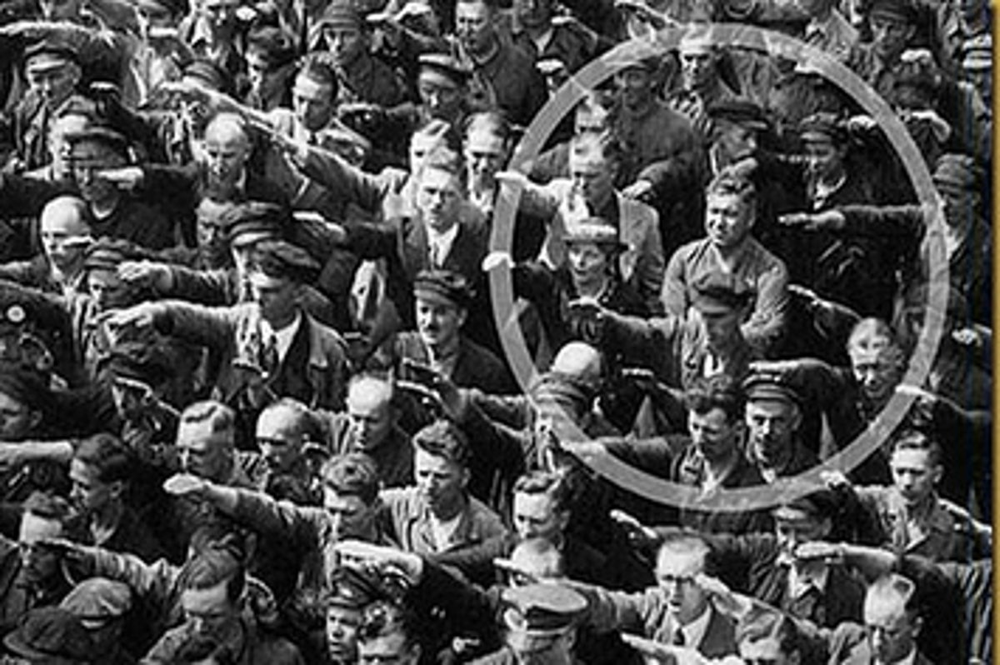
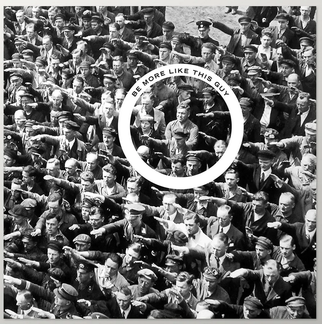

# Acknowledgement

The authors would like to thank the Open Science Office, University of Mannheim for the financial support of this project.

Know more: https://www.uni-mannheim.de/open-science/open-science-office/

---

# So, are these frames?

```{r xaringanExtra, echo = FALSE}
xaringanExtra::use_tile_view()
xaringanExtra::use_animate_all(params$animation)
#xaringanExtra::use_logo(image_url = "img/mzes_logo.png", width = 280)
mzesalike::use_footer(params)
```


.pull-left[


.extrasmall[Walter & Ophir (2019)]

]

.pull-right[


.extrasmall[Ylä-Anttila, Eranti, & Kukkonen. (2022)]


.extrasmall[Zeng, Chan & Schäfer (2019)]

]

---

.extralarge["Some studies employ the concept only in a metaphoric sense, whereas others reduce frames to story topics, attributes, or issue position"]

Carragee & Roefs (2004)

---

**Entmanian Frame:** "Select some aspects of a perceived reality and make them more salient in a communicating text, in such a way as to promote a particular problem definition, causal interpretation, moral evaluation, and/or treatment recommendation for the item described."

**Chan's restatement:** Frame is the result of an act of **selecting** certain aspects of a perceived reality by a communicator, whose **intention** is to promote a particular problem definition, causal interpretation, moral evalution, and/or treatment recommendation.

---

# What actually is frame detection?

.extralarge[
* Evaluate which aspects of a perceived reality are selected?
* Guess the communicator's intention?
]

---
class: hide-footer


---
class: hide-footer




---
class: hide-footer




---
class: hide-footer

# Generic frames

.pull-left[
"**transcend** thematic limitations and can be identified in relation to different topics, some even over time and in different cultural contexts" (de Vreese, 2005)


]

.pull-right[


.extrasmall[Semetko & Valkenburg (2000)]

]

---
# "Platinum" Standard: Communicative intention is known

.pull-left[


]

.pull-right[


]


---
# "Gold standard"

.pull-left[

]

.pull-right[
Two trained MA students coded according to the standard coding scheme

.extrasmall[Semetko & Valkenburg (2000)]

]

---

.pull-left[
# Inductive methods

* K-means with TFIDF (Burscher et al., 2016)
* PCA with TF-IDF (Greussing & Boomgaarden, 2017)
* LDA (DiMaggio et al., 2013)
* STM (Nicholls & Culpepper, 2021)
* ANTMN (Walter & Ophir, 2019)
]

.pull-right[

# Semi-supervised methods

* Seeded-LDA (Watanabe & Zhou, 2020)
* keyATM (Eshima et al., 2020)

Keywords from two journalism researchers

k = 5
]

---
# So many methodological decisions

* stemming, lemmatizing, trimming of sparse / frequent words, stopwords, $\alpha$, ...

* Multiverse Analysis (Pipal, Song, Boomgaarden, 2022)

.pull-left[

]


---
# Not better than random guess


---
# Slightly better than random guess


---
# Sometimes better than random guess

.pull-left[

]

.pull-right[

]

---
# Sometimes better than random guess, but with a large multiverse

.pull-left[

]

.pull-left[

]

---
# Often better than random guess, even with a large multiverse


---
# The golden question: Does gold standard work?

--

.pull-left[

]

.pull-right[
Always better than random guess, but not superb
]

---

# Zum Mitnehmen

.pull-left[
* Frame detection is not the same as finding topics (Carragee & Roefs, 2004)

* Detection of communicative intention from text is crazily hard, even human can't do it well. But..

* OSF: https://osf.io/gkft5/?view_only=8bf2a34000a64c5fa5d645c3f37f681a

(Or contact me)

]

.pull-right[

]
